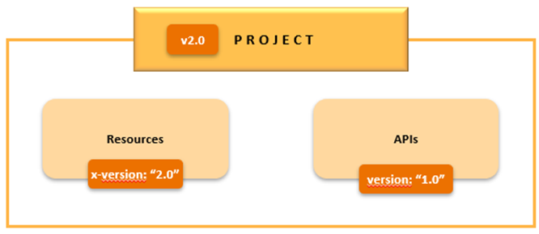

<!-- focus: false -->
 
<br>

<br>

# Whitepaper

## 1. Introduction

Nowadays, a large part of the web is made up of APIs (Application Programming Interfaces).

It is estimated that the most diverse companies, in 2017, had already about 17.000 APIs published for open consumption of services, almost double the 10.000 existing in 2013.

API development continues to evolve with the continued growth of APPs available for private and public use. Nowadays, APIs have become valuable tools at the service of companies, stimulating the emergence of an "[API economy](http://searchmicroservices.techtarget.com/definition/API-economy-application-programming-interface-economy )".

With most companies investing in this area of ​​business, getting know-how about the construction and operation of APIs becomes increasingly relevant. BPI is no exception, having set up a pilot project at DSI to explore the topic.

## 2. What is an API?

Simply put, an API can be seen as the "tool" that makes a website's data usable by a computer. Through an API, the computer can "see" and "edit" data. An API is a program, running on a server, that waits for others to call it to get data.

APIs connect business processes, services, content and data to partner channels, internal teams and independent applications, easily and securely. They are the standard by which companies exchange data and build consistent cross-channel experiences with customers.

Since HTTP is the main communication protocol used on the Web, it is natural that this is the basis for the construction of APIs (Web APIs - the use of a familiar protocol lowers the learning curve for programmers benefiting from the construction and use of APIs).

HTTP communication is based on the "Request-Response" concept. The client sends a request to the server to do something, the server responds to the client whether or not it can make the request or that it has been accepted for processing (in the case of asynchronous or event-based scenarios).

### 2.1. HTTP Request

<table>
  <p align="center">
    
  </p>
</table>

For these requests to be valid, the customer needs to include the parameters of image. These 4 parts represent a complete HTTP request.

#### 2.1.1. URL

In APIs the concept of URL is used in the sense of including names (such as customers, products, tweets), making the URL easy for the client to understand, in order to tell the server which entity it wants to interact with. These entities are called [resources](#31-resources).

#### 2.1.2. Method

The 'method' of the request tells the server what kind of action the client wants it to take. Corresponds to [HTTP protocol verbs](https://developer.mozilla.org/en-US/docs/Web/HTTP/Methods).

We considered it important to implement the following verbs in the BPI APIs:

-   **GET** – Asks the server to read an instance of a resource or list instances of a resource.
-   **POST** - Asks the server to create a new instance of a resource.
-   **PUT** - Asks the server to update the instance of a resource.
-   **DELETE** - Asks the server to delete an instance of a resource - logical delete, it can mean inactivate, or change the state of an instance, not necessarily eliminating a record in a data table.

In the implementation of APIs you must be **faithful to verbs**: GET must not change the state of the resource.

<!-- theme: info -->
> **PATCH** - this method asks the server to update **part** of a resource's information. We chose, for technical reasons of implementation, **not to implement this method**. 

<!-- theme: warning -->
>The PUT can cause problems with the [versioning](#6-versioning) of the APIs because, by adding a new attribute to this method, we would "force" our clients to update their applications (at the risk of invoking the method without passing this new attribute, it is being "cleaned" from the database).

#### 2.1.3 Headers

Metadata are passed as headers, such as the date/time when the client made the request, the body size, security and authorization tokens, etc.

#### 2.1.4. Body

The body will contain the data that the client wants to send to the server. Unlike the Method, URL or Headers where the HTTP protocol requires a rigid structure, in the body the client is allowed to send everything he needs.

### 2.2. HTTP Response

<table>
  <p align="center">
    
  </p>
</table>

Upon receiving the request from the client, the server executes it and sends a response back. The response structure is practically the same as the request, with the method and URL replaced by the inclusion of a 'Status Code'. Headers and body keep the same order format. These 3 parts represent a complete HTTP response.

#### 2.2.1. Status Codes

State numeric code, with 3 digits with unique meaning. See [HTTP Status Code](#5-http-status-codes) accepted by BPI APIs.

### 2.3. JSON

<table>
  <p align="center">
    
  </p>
</table>

The exchange of data between computers implies the message is understood by both. The most common message formats in APIs are JSON (JavasScript Object Notation) and XML (Extensible Markup Language). JSON is a much simple, easier to read, format. It stands in keys and values. Keys represent object's attributes and Values are those attributes values.

Example:
```json
{  
    "name": "João Silva",  
    "nationality": "PRT",  
    "birthDate": "1985-12-23"  
}  
```

The APIs created must use the JSON format: not only for its [implementation advantages](#27-rest-vs-soap), but also for being the "standard" implementation currently followed in the market by most companies, namely by those considered technologically leaders.

### 2.4. REST

REST stands for "Representational State Transfer" and is a design concept for managing information on the Web.

It's not a formal architecture, but it's simple to understand (_human-readable_) and can be adopted on virtually any client or server with HTTP/HTTPS support.

It works on an application data exposure logic, ie it is not functionality-oriented but entity-oriented, treating server-side objects as **resources** that can be created, changed or deleted.

This communication is done using the HTTP protocol for message transport, using the HTTP: GET, PUT, DELETE, POST, etc...

An API is called RESTfull when it follows a REST architecture:
[Example](http://www.ics.uci.edu/~fielding/pubs/dissertation/top.htm)

### 2.5. Linking

One key feature in REST is that a resource should only have its own attributes. Whenever we want to refer the consumer to other related resources, using links makes it easier. It's like www, where we follow links between pages. In REST we follow links between resources.

In this way, it is up to whoever invokes the API to access the returned links or not, if that is in their interest.

For example, in the customer query operation (GET /customers/{customerId}) we return the links to the respective resources of addresses, contacts, corporateContacts, identificationDocuments, supportingDocuments:

Example:
```json
{  
    "id": "00111078900100051T",  
    "kind": "api.bancobpi.pt/v1/customers",  
    "name": "JOAO SILVA",  
    "nationality": "PRT",  
    "branchCode": "0025",  
    "customerType": "Person",  
    "title": "Eng",  
    "status": "Active",  
    "birthDate": "1985-12-23",  
    "gender": "Male",  
    "maritalStatus": "Single",  
    "professionalStatus": "Employed",  
    "countryOfBirth": "BEL",  
    "_links": {  
      "self": {  
          "href": "http://api.bancobpi.pt/v1/customers/me"  
      },  
      "addresses": {  
          "href": "http://api.bancobpi.pt/customers/v1/customers/me/addresses"  
      },  
      "contacts": {  
          "href": "http://api.bancobpi.pt/customers/v1/customers/me/contacts"  
      },  
      "corporateContacts": {  
          "href": "http://api.bancobpi.pt/customers/v1/customers/me/corporate-contacts"  
      },  
      "identificationDocuments": {  
          "href": "http://api.bancobpi.pt/customers/v1/customers/me/identifications"  
      },  
      "supportingDocuments": {  
          "href": "http://api.bancobpi.pt/customers/v1/customers/me/supporting-documents"  
      }  
    }  
}  
```

### 2.6. SOAP

SOAP (Simple Object Access Protocol) é communication protcol between computers based upon XML messages.

It exposes an application logical componentes as services. [What is Soap.](https://www.tutorialspoint.com/soap/what_is_soap.htm)

### 2.7. REST vs. SOAP

<table>
  <p align="center">
    
  </p>
</table>

While SOAP is a communication protocolo on its own, REST is more an architectural design over HTTP protcol. It's a common mistake to refer to REST as a protocol, even though it is not.
In recent years, REST has gained strength over SOAP and is currently the most used communication approach using web services.


The following links have more information on this subject:

[Stackify](https://stackify.com/soap-vs-rest/)<br>
[Microsoft](https://msdn.microsoft.com/en-us/magazine/dd942839.aspx)<br>
[Business2community](http://www.business2community.com/brandviews/upwork/soap-vs-rest-look-two-different-api-styles-01827446#4lHZPqtxERqeLZ52.97)<br>
[Geeknizer](http://geeknizer.com/rest-vs-soap-using-http-choosing-the-right-webservice-protocol/)<br>
[Dzone](https://dzone.com/articles/web-services-architecture)<br>

#### 2.7.1. Advantages of REST over SOAP

- Shorter learning curve.
- Allows a greater variety of data format and not just XML, thus being more efficient.
- It becomes easier to work in REST as it uses JSON format (focus on data, faster parsing).
- The use of JSON provides greater support for browsers.
- Increased performance through _caching_ of information that is not changed.
- Approach used in most applications from companies like Yahoo, Ebay, Amazon and Google.
- It is generally faster and uses less bandwidth. Easier to integrate into sites where there is no need to change the infrastructure, which allows developers to develop faster (addition of additional features).

#### 2.7.2. Advantages of SOAP over REST

- Uses WS-Security and additional security policies for privacy and data integrity.
- In Rest there is no standard 'messaging' system, being the customer's responsibility to treat and perform 'Retrying' in case of communication failures. SOAP provides _built-in_ functionality for the message _success/retry_ logic, which allows to compensate for these communication failures between client and consumer (WS-ReliableMessaging).
- Guarantees ACID transactions (Atomicity, Consistency, Isolation, Durability), although not used often
- In Web Services that support more complex operations with the need to maintain content and context, the use of SOAP may require less code in the different layers (transactions, security, etc).
- If necessary, it is extensible through the use of other protocols and technologies, namely WS\* standards (WS-Addressing, WS-Coordination, WS-ReliableMessaging) and others, although it not used often.

It is now generally agreed that REST is the preferred approach for implementing APIs.

### 2.8. OpenAPI (swagger)

[OpenAPI](https://www.openapis.org/) is one of the most accepted standard for messaging in REST. OpenAPI (or swagger) is used loosly to refer to the API's contract file. This document is defined in JSON or YAML, and it contains the resources, the http verbs, the paths, content-types, status-codes, request and response bodies and usage samples.

## 3. API Design

When starting an API implementation, the most important is the design phase - **design time**.

At this stage it is crucial to define exactly what will be the **resources** of our API, the methods or operations that we will implement (GET, POST, etc.), the URLs to implement, etc.

To create an API that is easy to understand, flexible, and reusable, it's important to use a resource-oriented design approach. This approach organizes the API around meaningful concepts called resources. By doing so, developers can easily understand how the API works, make changes to it without breaking other parts of the system, and reuse components of the API in other parts of the system or even in other systems

APIs must be thought of as **products**, which provide relevant information to be used by **external and / or internal** applications to the Bank.

We **MUST** consider all API clients as external programmers, who at first do not know the logic and functioning of the business in BPI; as such, the information to be made available must be as abstract as possible, and not specific to a particular business / direction / application - that is, it must be thought of **from the inside out**. It can't be thought of a design to support only one very specific business case.

As the ultimate goal may be exposure to the outside world, an entire API must be defined in **English**.

### 3.1. Resources

A resource is similar to an object with a certain type, associated data, relationships with other objects and a set of methods that operate on it.

Basically, it corresponds to a **relevant entity for the business**, which can be created, changed or eliminated and having its own unique identifier.

An entity, as a **resource**, should not be confused with physical application entities, e.g. tables.
A resource can represent multiple data entities, as in _Contacts_ and _Accounts_.

Resource design must follow these rules:
- **Use of nouns**: When defining on a name for a resource, a noun should be selected instead of a verb, as a resource is meant to be an item and not an action.
- **Always in plural**: The resource should be defined using plural nouns, not singular nouns. The rationale behind this is the fact that as nouns, resources have attributes associated to them.
- **Use of kebab-case**: In resources that have names with more than one word, it should be used a kebab case approach where each word or abbreviation in the middle of the phrase is separated by a hyphen. This format is used to improve readability of the resource name (supporting-documents, not SupportingDocuments).
- **Use of lowercase letters**: Lowercase letters should always be preferred as URIs are case-sensitive when dealing with resources, so mixing uppercase and lowercase can induce in errors.

Examples:


#### 3.1.1 Resource Types

A resource can be a very abstract concept, thus making both its definition and scope very vague. The following typology serves as a guideline to help with this definition.

##### 3.1.1.1 Core Resources

Business relevante resources that are part of a certain domain. This is the default type.

Allowed methods: GET, POST, PUT and DELETE.

Example: 
```json
customer: {
  "completeName": "João Silva",
  "shortName": "João",
  "nationalities": [
    "PRT",
    "BRA"
  ],
  "birthDate": "2000-01-01T00:00:00.000Z",
  ...
}
```

##### 3.1.1.2 Virtual Resource

Resources that allow simplifying the relationship with a core entity, reducing the information needed to use the API and/or simplifying business rules.
The response of the interaction with this resource is the data sent in the operation plus the reference to its core resource. **Virtual resources do not have their own ID.** and must be very well considered before using them.

Métodos permitidos: GET (List), POST e PUT.

**Example**: A customer can have specific attributes when he is a self-employed person. However, internally, it is converted into a customer.

POST ou PUT /Self-employed-customers:
```json
{
  // dados comuns a todos os customers
  "completeName": "João Silva,
  "shortName": "João",
  "nationalities": [
    "PRT",
    "BRA"
  ],
  "birthDate": "2000-01-01T00:00:00.000Z",
  ...,
  // specific data for Self-employed-customers
  "professionalSituationEni": "administrativo",
  "activityInitialDate": "2000-01-01T00:00:00.000Z",
  "activityCountry": "PRT",
  ...
}
```

GET /Self-employed-customers:
```json
{
  "id": "123456",
  "completeName": "João Silva",
  "shortName": "João",
  "nationalities": [
    "PRT",
    "BRA"
  ],
  "birthDate": "2000-01-01T00:00:00.000Z",
  "professionalSituationEni": "administrativo",
  "activityInitialDate": "2000-01-01T00:00:00.000Z",
  "activityCountry": "PRT",
  "kind": "api.customers.bancobpi.pt/customers",
  "_links": {
    "self": {
      "href": "https://api.customers.bancobpi.pt/customers/123456"
    }
  },
}
```
##### 3.1.1.2 Procedural Resource

Resources that aggregate other entities in addition to their own attributes. They serve to facilitate and take the responsibility away from consumers of  APIs in having to manipulate several resources manually to meet a specific business need, thus making the operation very *chatty*.
**However, this type of entity should only exist in very specific cases, in which this approach is justified.**

Allowed methods: GET, POST and DELETE.

**Example**: Opening a checking-account.

```json
//checking-account-opening: 
{
  "type": "saving",
  "balance": "100.00",
  ...
  "customer": { //In this case, the customr may not exist and it should be created in the same execution.
    "id": "123456",
    "completeName": "João Silva",
    "shortName": "João",
    "nationalities": [
      "PRT",
      "BRA"
    ],
    "birthDate": "2000-01-01T00:00:00.000Z",
    ...
  }
}
```

### 3.2. Attributes

Each resource is composed of a series of attributes, i.e., fields that identify it and that can be manipulated.

Defining the attributes must take into account the following aspects:
- **Descriptive and consistent names**: Use descriptive and consistent names for attributes, to make it easier for developers to understand their purpose. Avoid using abbreviations and acronyms that may be unfamiliar to users.
- **Appropriate data types**: Use appropriate data types for attributes, such as strings, numbers, enumerations, or, if possible, a canonical type. This ensures that the data is consistent and can be properly validated.
- **Use of camelCase**: Use a consistent casing for attributes, such as camelCase, by combining words and capitalizing all words following the first word and removing the space.
- **Documentation**: Attributes documentation/description is extremely important for the developer who will use our APIs, to understand how they should be filled. By including information on their data type, format, validation rules, and any other relevant information, a meaning is added to the attribute, which is very helpful. Examples should also be used, with real anonymous scenarios, to make the API as consistent as possible.
- **Standard formats**: When defining the types of attributes, whenever possible, reference should be made to the corresponding **ISO** standard. Example:

  - [Country Code - Alfa 3](https://www.iso.org/iso-3166-country-codes.html)<br>
  - [Dates - With or without timestamp](https://www.iso.org/iso-8601-date-and-time-format.html)<br>
  - [Currency](https://www.iso.org/iso-4217-currency-codes.html)<br>

### 3.3. Methods

It's important to take into account the added value and usability of the operations to be implemented for our customers, and translate them to simple and intuitive endpoints.

This translation can be done by using appropriate HTTP methods for each action on a resource. For example, use GET to retrieve a resource, POST to create a new resource, PUT to update an existing resource, and DELETE to delete a resource.

It is not mandatory to implement all HTTP verbs, on the contrary, its implementation must be adapted to functional needs.

Used verbs tend to be applied to a corresponding CRUD operation. You can view this mapping on the following table:


HTTP VERB | CRUD
----------|----------
 GET | Retrieve
 POST | Create 
 PUT | Update
 DELETE | Delete


Please consult the following table for a list of examples on how to correctly use HTTP Verbs to map to certain API operations:


VERB | URI | ACTION | NOTES
-----|-----|--------|---------
 POST | /customers | Creates a customer | Information about the new customer is sent on the request body, usually as a JSON content
 PUT | /customers/{id} | Updates a customer with the sent values
 GET | /customers | Returns a list of customers
 GET | /customers/{id} | Returns the customer with id equal to {id}
 GET | /customers?name=miguel | Returns a list of customers with name equal to “Miguel”
 GET | /customers/{id}/contacts | Returns the contacts of the customer with id equal to {id}
 DELETE | /customer/{id} | Deletes the customer with id equal to {id} | We can choose not to implement since customers are not deleted. However, we can consider the DELETE operation to be a logical one, not necessarily corresponding to a deletion in the database, but a change of state. This must be clear in the documentation


The process of choosing the relevant methods and translating them into endpoints should follow some aspects:
- **Self-explanatory**: An HTTP method is always a verb and, when paired with the resource noun, the outcome of the endpoint must be clear, even without access to the associated documentation.
- **Hierarchy**: To indicate a hierarchical relationship between resources (composition or aggregation) a forward slash (/) should be used. Consequently, there is a clear hierarchical distinction between the various resources present in the URI. For example, http://api.example.com/customers/{id}/addresses shows the resource "customers" contains another resource named "addresses".
- [**Use standard HTTP status codes**](https://bancobpi.stoplight.io/docs/general-documentation/aeedc62427efc-whitepaper#5-http-status-codes): Use standard HTTP status codes to indicate the success or failure of a request. For example, use 200 OK to indicate success, 400 Bad Request to indicate a client-side error, and 500 Internal Server Error to indicate a server-side error.
- **Documentation**: It is extremely important to document the methods thoroughly. Include information on their purpose, parameters, request and response formats (success/failure). Only then the programmer (internal/external) who will develop applications using our APIs understands how to use them, without having to ask for help from those who implemented it.
- **Consistent request and response formats**: Use consistent request and response formats, to ensure consistency across your API.
- **Provide examples**: By providing examples for each method invocation, we can get an instant mock service with Stoplight, allowing testing our own API while designing it.
- **Use of query parameters**: When there is a need to filter through a collection that is called by a resource, a query parameter should be used instead of specifying the filter condition with another resource. To filter resources, a question mark “?” should be used.
  - **Key-value pair**: Each parameter is specified as a key-value pair, separated by an equal sign “=”, and multiple parameters are separated by an ampersand “&”: 
    **https://api.example.com/resource?param1=value1&param2=value2**
  - **Comma-separated values**: You can use a comma-separated list of values within a single query parameter. For example, **param=1,2,3** indicates that the parameter "param" has multiple values: 1, 2, and 3.
  - **Interval notation**: For representing intervals, you can use specific notation within the query parameter value. For example, **param=1-10** denotes a range from 1 to 10.

### 3.4. Common Models

When designing APIs, it's important to create some **common data** structures (models), in order to be reused in various operations.

By grouping the attributes that are used in more than one operation in models, **API maintenance** is facilitated and the same attribute is avoided being repeated in several places.

As examples of common models we used, we have:

-   [Common body](#41-common-body)
-   [Self link body](#42-self-link-body)
-   [Pagination](#43-pagination)
-   [Audit](#44-audit)
-   [Error block](#51-error-block)

### 3.5. Data type/format

[_Swagger_](#_OpenAPI_(swagger)) specification data type:

| **Common Name** | [**type**](https://github.com/OAI/OpenAPI-Specification/blob/OpenAPI.next/versions/2.0.md#dataTypeType) | [**format**](https://github.com/OAI/OpenAPI-Specification/blob/OpenAPI.next/versions/2.0.md#dataTypeFormat) | **Comments**                                                                                       |
| --------------- | ------------------------------------------------------------------------------------------------------- | ----------------------------------------------------------------------------------------------------------- | -------------------------------------------------------------------------------------------------- |
| integer         | integer                                                                                                 | int32                                                                                                       | signed 32 bits                                                                                     |
| long            | integer                                                                                                 | int64                                                                                                       | signed 64 bits                                                                                     |
| float           | number                                                                                                  | float                                                                                                       |                                                                                                    |
| double          | number                                                                                                  | double                                                                                                      |                                                                                                    |
| string          | string                                                                                                  |                                                                                                             |                                                                                                    |
| byte            | string                                                                                                  | byte                                                                                                        | base64 encoded characters                                                                          |
| binary          | string                                                                                                  | binary                                                                                                      | any sequence of octets                                                                             |
| boolean         | boolean                                                                                                 |                                                                                                             |                                                                                                    |
| date            | string                                                                                                  | date                                                                                                        | As defined by full-date - [RFC3339](http://xml2rfc.ietf.org/public/rfc/html/rfc3339.html#anchor14) |
| dateTime        | string                                                                                                  | date-time                                                                                                   | As defined by date-time - [RFC3339](http://xml2rfc.ietf.org/public/rfc/html/rfc3339.html#anchor14) |
| password        | string                                                                                                  | password                                                                                                    | Used to hint UIs the input needs to be obscured.                                                   |

[OpenAPI Specification](https://github.com/OAI/OpenAPI-Specification/blob/main/versions/3.0.0.md)

## 4. Common Models

To simplify the navigability of the API the following techniques were defined to be applied to all resources.

### 4.1. Common Body

The _common body_ is intended to group attributtes applicable to many or all resources.

Description of fields:

1. **kind**: _resource_'s namespace; for example, a list of customer returns rows with kind "API/VERSION/customers"

2. **id**: Unique identifier of the resource; for example, the id of a customer corresponds to the NIP

- Representation's structure:
```yaml
title: Common Body
...
allOf:
  - properties:
      id:
        type: string
        description: Resource's unique identification
        readOnly: true
      kind:
        type: string
        ...
        readOnly: true
    required:
      - id
      - kind
type: object
``` 

- Example of GET operation (GET /accounts/1234456):
```json
{
  "id":"1234456",
  "kind":"api.bancobpi.pt/v1/accounts",
  "accountType":"Checking Account",
  "status":"Active",
  "creationDate":"2001-09-11",
  "bookBalance":1250.23,
  "availableBalance":250.23,
  "currency":"EUR",
  "holderType":"Holder",
  "holderLevel":1
}
``` 

### 4.2. Self Link Body
The _self link body_ is intended to be an reference to itself, based on pattern [Hypertext Application Language (HAL)](https://datatracker.ietf.org/doc/draft-kelly-json-hal/).

Description of fields:
1. **\_links / self**: URL to the resource itself; for example, in lists each line has a URL with a link to the line detail.

- Representation's structure:
```yaml
type: object
title: Link Self Body
...
properties:
  _links:
    type: object
    description: Self link to the resource itself
    properties:
      self:
        $ref: '#/definitions/LinkBody'
    required:
      - self
definitions:
  LinkBody:
    type: object
    title: Link Body
    ...
    properties:
      href:
        type: string
        format: uri
        ...
        readOnly: true
    required:
      - href
```

- Example of GET operation (GET /accounts/1234456):
```json
{
  "id":"1234456",
  "kind":"api.bancobpi.pt/v1/accounts",
  "accountType":"Checking Account",
  "status":"Active",
  "creationDate":"2001-09-11",
  "bookBalance":1250.23,
  "availableBalance":250.23,
  "currency":"EUR",
  "holderType":"Holder",
  "holderLevel":1,
  "_links":{
    "self":{
      "href":"http://api.bancobpi.pt/v1/accounts/1234456"
    }
  }
}
``` 

### 4.3. Pagination

To perform the pagination of the results, we use the following parameters which can be passed in the _request_ as _querystring_:

-   **pageSize**: Number of desired records.
    -   Default value is 20 records per page.
    -   **Note**: The number of elements per page the service returns (e.g. CICS binding area) must be taken into account to optimize the performance and use of the service's resources.
-   **pageNumber**: Number of the page to retrieve.
    -   Default value is 1.

- JSON representation's structure:
```yaml
pageNumber:
  name: pageNumber
  in: query
  schema:
    type: integer
    default: 1
    minimum: 1
  description: Number of the page returned in a get list operation

pageSize:
  name: pageSize
  in: query
  schema:
    type: integer
    default: '20'
    minimum: 1
  description: Size of the page that will be returned in a get list operation
```

Example of a client request filtered by name and pageNumber of 20 lines:

**Example of GET**: //example.bancobpi.pt/customers-api/v1/customers?name=joao&pageSize=20

In the request's _response body_, links to the next and previous pages are returned ( **prev** and **next** ) when applicable. In case it is the first page and there is a second one, only the link to the **next** is returned. In a case it is the last page, only the link to **prev** is returned.

- YAML representation's structure:
```yaml
type: object
title: Link Pagination Body
...
properties:
  totalItems:
    type: integer
    description: The total number of items
    minimum: 0
  currentPage:
    type: integer
    description: The current page
    minimum: 0
  totalPages:
    type: integer
    description: The total number pages
    minimum: 0
  _links:
    type: object
    description: Pagination linking area
    properties:
      prev:
        $ref: '#/definitions/LinkBody'
      next:
        $ref: '#/definitions/LinkBody'
required:
  - totalItems
  - currentPage
  - totalPages
definitions:
  LinkBody:
    type: object
    title: Link Body
    ...
    properties:
      href:
        type: string
        format: uri
        description: URL to reach the next step
    required:
      - href
```

- Example of GET operation with pagination (GET /accounts?pageNumber=2&pageSize=20):
```json
{
  "accounts": [
    {
      "id":"1234456",
      "kind":"api.bancobpi.pt/v1/accounts",
      "accountType":"Checking Account",
      "status":"Active",
      "creationDate":"2001-09-11",
      "bookBalance":1250.23,
      "availableBalance":250.23,
      "currency":"EUR",
      "holderType":"Holder",
      "holderLevel":1
    },
    ...
  ],
  "totalItems": 100,
  "currentPage": 2,
  "totalPages": 5,
  "_links": {
    "prev": {
      "href": "https://examplehost/exampleapi/v1/example-resource?pageNumber=1"
    },
    "next": {
      "href": "https://examplehost/exampleapi/v1/example-resource?pageNumber=3"
    }
  }
}
``` 
> Note that the response code **HTTP 200** means that the result fits on a single page; if a **HTTP 206** code is returned, then it means the result is a partial content (in relation to the whole result), that is, there will be more pages to show. Even the last page will return **HTTP 206**. The way to see if we are on the last page is to check if there is the **next.** attribute in the response header.

### 4.4 Audit

It is a block of attributes* created to standardize the need for auditing in some entities/apis.

***Attributes**: createdBy, createdData, alteredBy and alteredDate.

As these attributes have an audit-only effect, they are all read-only. This means it will only be returned in the RESPONSE of operations.

[Audit Block](https://bancobpi.stoplight.io/docs/commons-api-definitions/75b252c1c86b4-audit)

If your API needs to include the attributes listed above, it is recommended that the audit block be implemented.
Below are two examples, one without and the other with the audit block to make it clearer.

Example:

/products/123

**Response without AUDIT:**

```json
{
  "id": "10499532-8ae3-4f61-a97e-a9583d8dc2e4",
  "kind": "api-name.bancobpi.pt/v1/resource-name",
  "name": "Laptop",
  "amount": 999,
  "_links": {
    "self": {
      "href": "https://examplehost/exampleapi/v1/example-resource/1"
    }
  }
}
```

/products/123

**Response with AUDIT:**
```json
{
  "id": "10499532-8ae3-4f61-a97e-a9583d8dc2e4",
  "kind": "api-name.bancobpi.pt/v1/resource-name",
  "name": "Laptop",
  "amount": 999,
  "_links": {
    "self": {
      "href": "https://examplehost/exampleapi/v1/example-resource/1"
    }
  },
  "createdBy": "657891",
  "createdDate": "2022-08-24T14:15:22Z",
  "alteredBy": "657891",
  "alteredDate": "2022-08-24T14:15:22Z"
}
``` 

Inside your entity, add one more object to your allOf and make reference to `Design Library/Audit`.

Example:


## 5. HTTP Status Codes

HTTP Status codes that an API can return may by group by such:

SUCCESS

| **HTTP Code** | **Meaning**| Design | Platform | **VERBS** |
| --------------- | ------------------------------------------------------------------------------------------ | --------- |------------|----------------- |
| 200             | "OK"<br>The request has succeeded                                                       |    YES    | | GET, PUT |
| 201             | "Created"<br>The request has been fulfilled and resulted in a new resource being created.                                                    | YES | | POST             |
| 202             | "Accepted"<br>The request has been accepted for processing, but the processing has not been completed.                                         | YES | | POST             |
| 204             | "No content"<br>The server has fulfilled the request but does not need to return an entity-body, and might want to return updated metainformation.                           | YES | |  DELETE      |
| 206             | "Partial Content"<br>The server has fulfilled the partial GET request for the resource. E.g. large file downloads. | YES | | GET              |

CLIENT ERROR

| **HTTP Code** | **Meaning**| Design | Platform | **VERBS** |
| --------------- | ------------------------------------------------------------------------------------------ | --------- |------------|----------------- |
| 400             | "Bad Request"<br>The request could not be understood by the server due to malformed syntax.                                  |YES| | GET, POST, PUT, DELETE |
| 401             | "Unauthorized"<br>The request requires user authentication.                                             | | YES | GET, POST, PUT, DELETE |
| 403             | "Forbidden"<br>The server understood the request, but is refusing to fulfill it. | | YES |  GET, POST, PUT, DELETE |
| 404             | "Not Found"<br>The server has not found anything matching the Request-URI.| YES | YES | GET, POST, PUT, DELETE |
| 405             | "Method Not Allowed"<br>The method specified in the Request-Line is not allowed for the resource identified by the Request-URI.| | YES | GET, POST, PUT, DELETE |
| 409             | "Conflict"<br>The request could not be completed due to a conflict with the current state of the resource.| YES |  | POST, PUT, DELETE |

SERVER ERROR

| **HTTP Code** | **Meaning**| Design | Platform | **VERBS** |
| --------------- | ------------------------------------------------------------------------------------------ | --------- |------------|----------------- |
| 500 | "Internal Server Error"<br>The server encountered an unexpected condition which prevented it from fulfilling the request. | YES | YES | GET, POST, PUT, DELETE |

### 5.1. Error Block

Each error type has its own error structure. It is made up of the general error block plus its specific one.

Representation of the general error structure created for client and server errors:


> Note: This yaml, as well as the other common types of this project, can be directly referenced within API projects. This makes API design easier as it is no longer necessary to replicate every common model.

**Specific 400 error example:**
```json
{
  "type": "https://api.bancobpi.pt/validation-error",
  "title": "bad-request",
  "status": 400,
  "detail": "Invalid values in the request",
  "instance": "/simulations",
  "language": "en-US",
  "requestId": "c4ea66ad-0caa-4e0a-99b1-5fc47dd3b723",
  "errors": [
    {
      "type": "https://api.bancobpi.pt/business-error-field",
      "field": "term",
      "rejectedValue": "null",
      "description": "term field must not be null or empty"
    }
  ],
  "_links": {
    "self": {
      "href": "https://.../simulations"
    }
  }
}
```

## 6. Versioning

An API should be designed considering its use on the long-term, but since change is inevitable, the API will never be completely stable per say. API change management can be addressed by a versioning strategy that should include:
- A schedule for discontinuing old versions of the API;
- Up-to-date documentation describing the technical changes per version;
- Detailed explanation of why the changes are needed from a business perspective.
In the current context, the main goal of the versioning strategy is to allow changes on a resource or on the API definition in an independent way, without necessarily changing the version of both.



This is achieved by defining a specific version for the resources and other for the APIs, which means that the project version of the API could be different than these two and is represented by the branch name.

## 7. Status

The **status** entity provides a means of tracking the status of a resource. If it has several changes, depending on the request, it can return only the most recent change or even the list of changes.

### Synchronous APIs

The states that are supported by get,post,put and delete must use the same. The idea of using status would only be for "transient" states.

OBS: By default, if the pageSize is not sent, the default value of 1 will be assumed and in this way it will only return the current status of the resource. If you want to see the history of changing the status of a resource, just pass this variable and with a value other than 1.

Example:

**GET /customers/123/status** - Check current status

```json
{
  "status": [
    {
      "id": "10499532-8ae3-4f61-a97e-a9583d8dc2e4",
      "kind": "api-name.bancobpi.pt/v1/resource-name",
      "status": "active",
      "createdBy": "657891",
      "createdDate": "2022-08-24T14:15:22Z",
      "alteredBy": "657891",
      "alteredDate": "2022-08-24T14:15:22Z"
    }
  ]
}
````

**POST /customers/123/status** - Change status

Input:
```json
{
  "status": "suspended"
}
````

Output:
```json
{
  "id": "10499532-8ae3-4f61-a97e-b9683d9dd5g2",
  "kind": "api-name.bancobpi.pt/v1/resource-name",
  "status": "suspended",
  "createdBy": "657891",
  "createdDate": "2022-08-26T10:37:01Z",
  "alteredBy": "657891",
  "alteredDate": "2022-08-26T10:37:01Z"
}
````

**GET /customers/123/status?pageSize=5** - Check state change history, indicating a pageSize greater than 1


```json
{
  "status": [
    {
      "id": "10499532-8ae3-4f61-a97e-a9583d8dc2e4",
      "kind": "api-name.bancobpi.pt/v1/resource-name",
      "status": "active",
      "createdBy": "657891",
      "createdDate": "2022-08-24T14:15:22Z",
      "alteredBy": "657891",
      "alteredDate": "2022-08-24T14:15:22Z"
    },
    {
      "id": "10499532-8ae3-4f61-a97e-b9683d9dd5g2",
      "kind": "api-name.bancobpi.pt/v1/resource-name",
      "status": "suspended",
      "createdBy": "657891",
      "createdDate": "2022-08-26T10:37:01Z",
      "alteredBy": "657891",
      "alteredDate": "2022-08-26T10:37:01Z"
    }
  ],
  "totalItems": 2,
  "currentPage": 1,
  "totalPages": 1,
  "_links": {
    "self": {
      "href": "https://examplehost/exampleapi/v1/example-resource/1"
    }
  }
}
````

### Asynchronous APIs

For some business cases, there might the be need to develop APIs that perform long-running tasks. To avoid blocking the execution flow, these APIs should be designed considering the “async-first” principle, that emphasizes prioritizing and designing APIs with asynchronous behavior in mind to support non-blocking operations.

The APIs that follow this pattern should contain the word “async” in the path, and the following steps should be taken into consideration:
1. The client application makes a synchronous call to an API, triggering a long-running operation on the backend – the API responds synchronously, as quickly as possible, with a HTTP 202 (Accepted) status code, acknowledging that the request has been received for processing.
2. The body of the response holds a location reference pointing to an endpoint that the client can pool to check for the result of the long running operation (status endpoint).
3. For every successful call to the status endpoint, it returns HTTP 202. While the work is still pending, the status endpoint returns a resource that indicates the work is still in progress.
4. Once the work is complete, the status endpoint can either return a resource that indicates completion or redirect to another resource URL.
