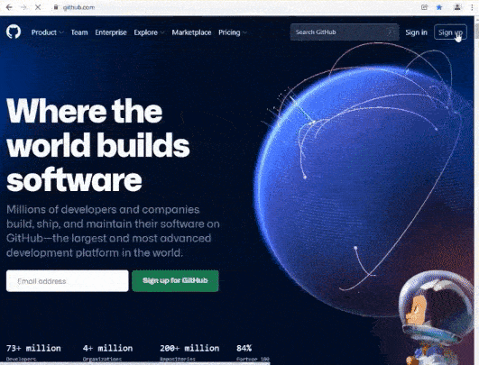
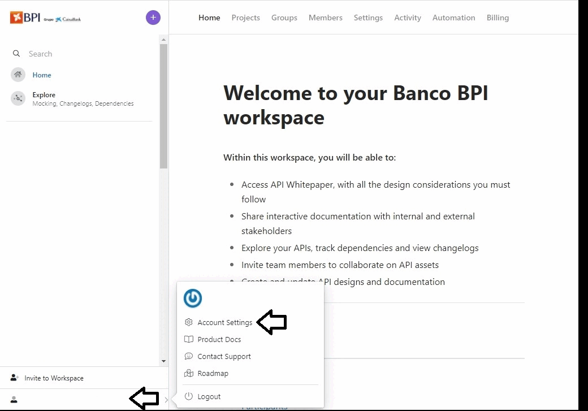

# GitHub Account

## How to Create a GitHub Account

Go to [https://github.com/](https://github.com/)

After this step, enter the code received by email.

Select option over fifty and don't need to select anything between student or teacher.

Select the options that you like the most or if you prefer you don't need to select anything.

Account **CREATED**.

## Connect Github with Stoplight

Go to [https://bancobpi.stoplight.io/](https://bancobpi.stoplight.io/)

Now you have the GitHub account created and synced with StopLight.

You are now ready to create your first API. Good Luck.
