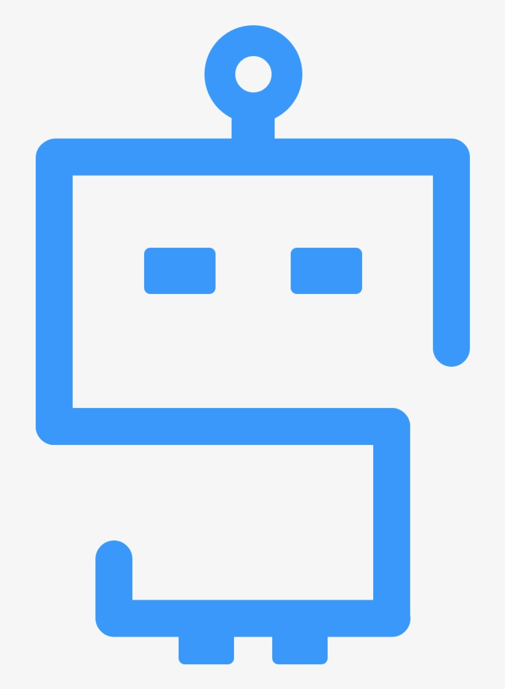

  

## Welcome to your Banco BPI workspace

  

[What are APIs and what are the guidelines for Banco BPI](https://bancobpi.stoplight.io/docs/general-documentation/ZG9jOjQ2MTY0ODI1-whitepaper)
 

  

[To be able to view documents and projects, it is necessary to create a Stoplight account.](https://bancobpi.stoplight.io/docs/general-documentation/ZG9jOjQ2MTY0ODI2-stoplight-account)
 

  

[To be able to build APIs, it is necessary to create a GitHub account](https://stoplight.io/api/v1/projects/cHJqOjEyMTg4Ng/images/l1WjBpb1lGA)
  

<!-- theme: info -->
> If you can't find what you're looking for or have any questions, please contact the Design Authority team dsi-designauthority@gbpi.loc.
---

<!-- focus: false -->

